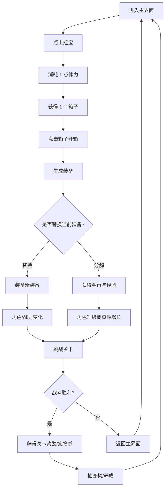
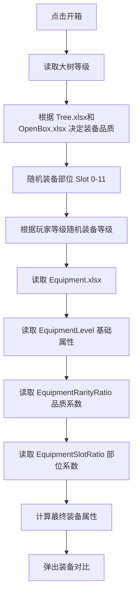
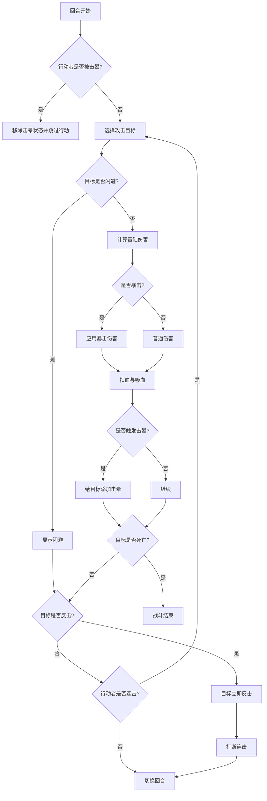

# OpenBox 协作开发策划案

> 版本：v0.1  
> 来源：根据初版 PDF《OpenBox》整理  
> 用途：用于两人协作开发、任务拆分、AI 辅助生成代码与后续迭代  
> 当前目标：先完成一个可玩的最小循环，而不是一次性复刻完整商业化系统。

---

## 0. 协作约定

### 0.1 文档标记

- `[MVP]`：首个可玩版本必须完成。
- `[Post-MVP]`：首版之后再做。
- `[待讨论]`：原策划中未确定，或实现前必须先拍板。
- `[推断]`：根据原策划补全的实现建议，不是原文明确内容。

### 0.2 推荐协作方式

- 使用 Git 管理代码与数据表。
- 使用 Issue 拆任务，不直接把大段需求扔给 AI 生成完整项目。
- 每个功能模块独立提交，便于回滚。
- 所有数值表修改必须说明原因。
- AI 生成代码后，至少由另一人进行一次 Review。

### 0.3 推荐目录结构

```text
OpenBox/
├── Docs/
│   ├── OpenBox_Collab_GDD.md
│   ├── Combat_Design.md
│   └── DataSchema.md
├── Assets/
│   ├── Images/
│   ├── UI/
│   └── Audio/
├── Data/
│   ├── RoleAttr.xlsx
│   ├── Tree.xlsx
│   ├── Equipment.xlsx
│   ├── SellEquipment.xlsx
│   └── Stage.xlsx
├── Source/
│   ├── Core/
│   ├── UI/
│   ├── Combat/
│   ├── Equipment/
│   ├── Pet/
│   └── Stage/
└── README.md
```

---

## 1. 项目概述

### 1.1 游戏定位

`OpenBox` 是一个基于《寻道大千》核心体验进行大幅简化改造的挂机推图游戏。

核心保留三件事：

1. 开箱获得装备。
2. 装备与宠物搭配。
3. 回合制自动战斗与推关成长。

首版目标不是做完整商业化游戏，而是做出一个稳定、可迭代的最小成瘾循环。

### 1.2 目标体验

玩家通过反复挖箱子、开装备、换装或分解装备来成长，并通过闯关验证战斗力。闯关奖励宠物券，宠物进一步影响战斗属性。

### 1.3 核心循环



### 1.4 成长阶段

- 成长期：砍树 / 挖箱子 = 升级。
- 满级后：砍树 / 挖箱子 = 刷装备词条。

> [待讨论] “砍树”和“挖箱子”在实现中是否是同一个按钮/行为？原策划中两者概念接近，但需要统一命名与表现。

---

## 2. MVP 范围

### 2.1 MVP 必须实现

- [ ] 主界面。
- [ ] 角色基础数据与属性面板。
- [ ] 挖宝按钮。
- [ ] 体力消耗逻辑。
- [ ] 箱子生成。
- [ ] 开箱生成装备。
- [ ] 装备对比弹窗。
- [ ] 替换装备。
- [ ] 分解装备获得金币与经验。
- [ ] 角色等级影响装备等级。
- [ ] 大树等级影响装备品质概率。
- [ ] 12 个装备位。
- [ ] 回合制战斗。
- [ ] PVE 关卡。
- [ ] 战斗胜负结算。
- [ ] 通关奖励宠物券。
- [ ] 抽宠物。
- [ ] 选择一只宠物上阵。
- [ ] 宠物升级。
- [ ] 宠物分解获得饲料。

### 2.2 MVP 可以暂缓

- [ ] 排行榜。
- [ ] PK 换排名。
- [ ] 宠物锁定功能。
- [ ] 多品质箱子外观。
- [ ] 完整通用背包系统。
- [ ] 完整开箱动画。
- [ ] 商业化系统。
- [ ] 离线收益。
- [ ] 复杂新手引导。

---

## 3. 角色系统

### 3.1 等级

- 角色初始等级为 `1`。
- 角色升级不直接增加属性。
- 角色等级关联挖箱子获得物品的等级，主要影响装备等级。


### 3.2 属性类型

角色属性包括：

| 属性 | 说明 |
|---|---|
- 基础属性
| 攻击力 | 影响普通伤害 |
| 防御力 | 抵消受到的攻击伤害 |
| 生命值 | 战斗生命上限 |
| 敏捷 | 谁数值大谁先手 |

- 战斗属性
| 暴击 | 攻击时触发暴击的概率 |
| 反击 | 在对手回合触发反击的概率 |
| 连击 | 当次攻击后继续攻击的概率 |
| 闪避 | 躲避对手攻击的概率 |
| 击晕 | 让对方被控制 1 回合的概率 |
| 吸血 | 根据造成伤害回复生命 |

| 抗暴击 | 减少对方暴击 |
| 抗反击 | 减少对方反击 |
| 抗连击 | 减少对方连击 |
| 抗闪避 | 减少对方闪避 |
| 抗击晕 | 减少对方击晕 |
| 抗吸血 | 减少对方吸血 |

- 特殊属性
| 强化爆伤 | 增加暴击后增加的伤害倍率 |
| 弱化爆伤 | 减少对方暴击后增加的伤害倍率 |
| 最终增伤 | 伤害最终乘法系数 |
| 最终减伤 | 减少对方的最终增伤 |
| 强化治疗 | 强化角色和宠物的治疗效果 |
| 弱化治疗 | 弱化对方角色和宠物的治疗效果|
| 强化宠物 | 强化宠物的伤害 |
| 弱化宠物 | 弱化对方宠物的伤害|


### 3.3 属性计算

最终角色属性：

```text
最终角色面板属性 = 角色基础属性 + 装备属性 + 上阵宠物固定属性 + 上阵宠物天赋属性
```

战斗中的角色属性原则上使用最终角色面板属性。

原策划中基础属性来自 `RoleAttr.xlsx`。

百分比属性在表格中填写的是乘以 `100` 后的值。例如：

```text
暴击率 = 5 表示 5%
```
### 3.4 战斗力计算
根据RoleAttr表中的CombatPower列，读取每一个属性的每单位战力值。
这里需要注意：百分比属性，每单位指的是每1%
最终将所有属性的战力加总，得到角色总战力


宠物固定属性和宠物天赋属性计入角色面板与战力；宠物主技能只在战斗中按触发规则生效，不直接计入常驻面板属性。

---

## 4. 挖箱子系统

### 4.1 挖宝行为

- 玩家点击“挖宝”按钮进行挖宝。
- 每次挖宝必定挖出一个箱子。
- 每次挖宝消耗 `1` 次体力。

> [待讨论] 体力获取方式待定。可选方案：自然恢复、看广告、通关奖励、每日领取、金币购买。


### 4.2 箱子品质

MVP 暂时只有：

- 6 种箱子品质。
- 6 种箱子外观。

> [推断] 装备品质仍然可以由大树等级决定；箱子外观先不随品质变化。

---

## 5. 开箱与装备系统

### 5.1 开出装备

开箱后必须当场决定是否保留装备。

玩家只有两个选择：

1. 替换当前装备。替换后的装备视为分解。
2. 分解新装备。


### 5.2 装备分解

分解装备获得：

- 金币。
- 主角经验值。

获得数量与装备等级直接相关，读取 `SellEquipment.xlsx`。

### 5.3 装备槽位

玩家共有 `12` 个装备位。

```text
Slot: 0 - 11
```

> [待讨论] 12 个部位的具体命名需要确定，例如：武器、头盔、衣服、鞋子、戒指、项链等。

### 5.4 装备属性

每件装备包含：

- `4` 条基础属性，分别是攻击力、防御力、生命值、敏捷。
- 等级大于 `BattleAttrLevelLimit`，且品质大于 `BattleAttrRareLimit` 的装备，额外带 `1` 条战斗属性。阈值读取 `GlobalConfig.xlsx`。
- 等级大于 `AntiBattleAttrLevelLimit`，且品质大于 `AntiBattleAttrRareLimit` 的装备，额外带 `1` 条战斗抗性。阈值读取 `GlobalConfig.xlsx`。
- 战斗属性从战斗属性池中等权重随机 `1` 条；战斗抗性从抗性属性池中等权重随机 `1` 条。
- 所有装备属性都使用 5.6 的公式计算。基础属性最终取整；战斗属性和战斗抗性保留 `1` 位小数，显示为百分比，例如 `2.5%`。


### 5.5 箱子掉落逻辑

开箱生成装备的流程：



装备等级随机范围暂定：

```text
装备等级 = 玩家等级 + Random(-3, +3)
装备最大等级为100，最小等级为1
```


### 5.6 装备属性计算

原策划公式：

```text
最终装备属性 = 基础值 × 品质系数 × 部位系数 × 随机浮动系数
随机浮动系数 = Random(1 - x%, 1 + x%)
```

数据来源：

| 数据 | 表 | 说明 |
|---|---|---|
| 基础属性 | `Equipment.xlsx / EquipmentLevel` | 根据装备等级读取 |
| 品质系数 | `Equipment.xlsx / EquipmentRarityRatio` | 根据装备品质读取 |
| 部位系数 | `Equipment.xlsx / EquipmentSlotRatio` | 根据装备部位读取 |
| 浮动范围 | `EquipmentAttrRandom.xlsx` | 根据装备等级读取，每个属性有各自的浮动范围 |

`EquipmentAttrRandom.xlsx` 中的浮动范围填写百分比数值。比如 `AttackRandomRange = 10` 表示攻击最终值在 `-10%` 到 `+10%` 之间随机浮动。

计算后的数值规则：

- 基础属性：攻击力、防御力、生命值、敏捷，最终值取整。
- 战斗属性和战斗抗性：最终值保留 `1` 位小数，显示为百分比，例如 `2.5%`。

---

## 6. 大树系统

### 6.1 功能定位

大树可以升级。升级后，玩家有更高概率开出更好的装备。

### 6.2 MVP 实现

- 大树拥有等级。
- 大树等级影响装备品质掉落概率。
- 掉落概率读取 `Tree.xlsx`。

### 6.3 待讨论问题

- [ ] 大树升级消耗什么资源？金币、经验、树经验还是其他材料？
- [ ] 大树升级是否有时间限制？
- [ ] 大树等级上限是多少？
- [ ] 大树等级是否影响箱子外观？
- [ ] 大树是否就是主界面中的“砍树”对象？

---

## 7. 宠物系统

### 7.1 宠物定位

宠物会参战，但不作为被攻击目标。
宠物没有生命值，不承受伤害，也不会死亡。

宠物系统在 MVP 中需要支持：抽取、保存、上阵、升级、吞噬、分解、固定属性生效、天赋属性生效和主技能自动释放。

### 7.2 宠物实例与持有上限

- 每次抽到宠物都生成一个独立宠物实例，而不是只记录宠物种类。
- 第一版本先做 `3` 种宠物。同种宠物可以因为品质、等级、天赋词条和天赋品质不同而形成不同实例。
- 玩家最多保存 `30` 个宠物实例。
- 宠物列表界面显示当前宠物数量，例如 `25/30`。
- 点击主界面的宠物按钮，打开宠物界面，可以看到当前拥有的宠物列表。

宠物实例至少需要保存：

| 字段 | 说明 |
|---|---|
| InstanceID | 宠物实例唯一 ID |
| PetID | 宠物配置 ID |
| Rarity | 宠物自身品质 |
| Level | 宠物等级 |
| AbsorbCount | 吞噬次数 |
| TalentList | 天赋词条列表 |
| TalentLevelList | 每个天赋词条等级 |
| IsDeployed | 是否上阵 |

### 7.3 上阵规则

- 同一时间只能有 `1` 只宠物上阵。
- 玩家可以在宠物界面切换上阵宠物。
- 上阵宠物不能作为吞噬素材，也不能被分解。
- 被替换下阵的宠物保留等级、吞噬次数、天赋词条和天赋等级。
- 只有上阵宠物的固定属性、天赋属性和主技能生效；未上阵宠物不生效。

### 7.4 抽宠与初始生成规则

抽宠物界面后续再做完整设计，当前先确定宠物实例生成规则。

- 获得宠物需要消耗宠物券。
- 抽宠入口、宠物池、权重和保底规则等到实现抽宠界面时再补表。
- 抽到宠物后，如果宠物背包未满，选择“保留”会直接加入宠物背包。
- 如果宠物背包已满，抽宠入口需要提示玩家先返回宠物界面分解宠物，不能继续抽取。
- 抽到宠物时，根据宠物自身品质从 `TalentSkillNum` 读取初始天赋词条数量。
- 宠物自身品质和天赋词条品质相互独立。
- 初始天赋先随机词条属性，再随机该词条的品质。
- 同一只宠物的初始天赋词条不能重复；同类词条即使品质不同也视为重复，不能同时出现。
- `TalentSkill` 中预留的品质 4 字段保留，但首版如果 `Pets` 只有品质 1-3，则暂时不读取品质 4。

### 7.5 宠物固定属性

- 宠物固定有攻击百分比、防御百分比、生命百分比 `3` 项属性。
- 这 `3` 项属性都加给主角，对宠物自身无影响。
- 固定属性随宠物升级增长。
- 固定属性只在宠物上阵时生效。
- 玩家在角色面板看到的是加总宠物固定属性、宠物天赋属性和装备属性后的结果。

### 7.6 宠物天赋技能

- 每个宠物最多拥有 `4` 个天赋词条。
- 天赋词条全部为加属性效果。
- 初始天赋词条数量根据宠物品质从 `TalentSkillNum` 读取。
- 天赋词条从 `TalentSkill` 中按权重随机生成。
- 天赋最终数值公式为：

```text
天赋最终数值 = 初始值 + 成长值 * (天赋等级 - 1)
```

- 百分比属性沿用全局规则：表格填写 `5` 表示 `5%`。
- 宠物固定属性、宠物天赋属性和装备百分比属性先全部相加，再与对应基础值相乘。
- 天赋属性只在宠物上阵时生效。

### 7.7 吞噬规则

- 只能吞噬同 `PetID`、未上阵、非当前目标宠物的宠物实例。
- 每吞噬 `1` 只同名宠物，目标宠物 `AbsorbCount + 1`。
- 每次吞噬时，在目标宠物已有且未满级的天赋词条中随机选择 `1` 条提升 `1` 级。
- 随机天赋升级目标时，先排除已满级词条。
- 如果目标宠物所有天赋词条都已满级，则不能继续吞噬。
- 吞噬素材宠物被消耗后从背包中移除。
- 若被吞噬的素材宠物等级大于 `1`，则返还饲料，返还规则读取 `PetLevelup.FoodReturn`。
- 吞噬不改变宠物主技能。
- 吞噬次数上限从 `TalentSkillNum.AbsorbLimit` 读取。当前表格逻辑为：`天赋技能数量 * (天赋技能最高等级 - 1)`。

### 7.8 吞噬星级表现

- 星级只用于展示吞噬进度，不等同于宠物品质。
- 宠物品质和星级没有任何关系。
- 宠物界面显示 `5` 个星位。
- 每吞噬 `1` 次点亮 `1` 颗星。
- 每 `5` 次吞噬换一种星色，并从第 `1` 个星位开始覆盖之前颜色。
- 实际吞噬进度仍以 `AbsorbCount` 数值保存。
- 星色循环配置从 `Stars` 页读取。

### 7.9 宠物升级与分解

- 宠物升级是 MVP 必做内容。
- 宠物升级消耗饲料，升级消耗从 `PetLevelup` 读取。
- 宠物最高等级为 `100`。
- 满级后升级按钮不可点击。
- `PetLevelup` 中若存在 100 级到 101 级的消耗行，最高等级为 100 时约定忽略该行。
- 升级只提升宠物固定的攻击百分比、防御百分比、生命百分比，不改变主技能倍率和天赋词条。
- 在界面中，选中的宠物如果升下一级所需饲料足够，则升级按钮可点，否则不可点。
- 玩家可以手动分解未上阵宠物，分解后获得饲料。
- 饲料的其他来源后续再讨论，当前已确定来源包括宠物分解和吞噬返还。

### 7.10 宠物主技能战斗规则

- 每个宠物拥有 `1` 个主技能。
- 主技能由 `Pets` 表配置，战斗中自动触发。
- `CastInterval` 表示己方角色行动回合数。
- 战斗开始后从 `0` 计数，不在开场立即释放。
- 每当我方角色要行动前，宠物技能计数 `+1`。
- 当计数达到 `CastInterval` 时，宠物先于角色释放主技能，然后角色再行动。
- 释放后计数重置，重新累计下一次释放。
- 攻击型宠物技能伤害使用：

```text
宠物技能伤害 = 主角攻击力 * DamagePercent
```

- 攻击型宠物技能受“强化宠物 / 弱化宠物”和最终增减伤影响。
- 治疗型宠物技能治疗使用：

```text
宠物技能治疗 = 主角攻击力 * HealPercent
```

- 治疗型宠物技能受“强化治疗 / 弱化治疗”影响。
- 宠物技能不触发暴击、吸血、击晕、连击、反击等普通攻击衍生效果。
- Buff 类宠物技能同属性同来源可叠加到 `MaxStack`。
- Buff 再次获得时刷新持续回合。
- `DurationRounds=999` 视为持续到战斗结束。
- 技能目标只分为敌方角色和我方角色，根据技能类型区分。

### 7.11 界面与操作反馈

宠物界面需要展示：

- 当前上阵宠物。
- 宠物品质。
- 宠物等级。
- 吞噬星级。
- 主技能。
- 固定属性。
- 天赋词条。
- 宠物背包数量。

宠物吞噬界面需要展示：

- 目标宠物。
- 可选同名素材。
- 不可选原因。
- 预计吞噬收益。

操作反馈规则：

- 吞噬前需要二次确认，尤其当素材宠物等级、品质或天赋较高时。
- 分解前需要二次确认。
- 升级、上阵、下阵、吞噬、分解后需要立即刷新角色面板属性和战力。
- 宠物锁定功能首版先不做，后续再加。

---

## 8. 抽宠物系统

### 8.1 抽宠物消耗

- 获得宠物需要消耗宠物券。
- 主界面显示玩家当前剩余的宠物券数量。

### 8.2 抽到宠物后的处理

抽到宠物后：

- 如果宠物背包未满，玩家选择“保留”后，宠物直接进入背包。
- 如果宠物背包已满，抽宠入口需要提示玩家先返回宠物界面分解宠物，不能继续抽取。
- 抽宠界面暂不做“替换当前宠物”流程。

### 8.3 吞噬收益

吞噬宠物用于提升目标宠物的天赋词条等级：

- 目标宠物吞噬次数 `+1`。
- 在目标宠物已有且未满级的天赋词条中随机 `1` 条提升 `1` 级。
- 素材宠物等级大于 `1` 时，根据 `PetLevelup.FoodReturn` 返还饲料。
- 吞噬不提供宠物经验、金币、主角经验或词条刷新次数。

---

## 9. 战斗系统

### 9.1 战斗类型

MVP 采用自动回合制战斗。

玩家点击关卡按钮后进入战斗界面，战斗自动进行。

### 9.2 基础伤害

原策划定义：

```text
伤害 = max(1, 攻击 - 防御) × max(1,(1 + 最终增伤 - 对方最终减伤))
```

其中百分比属性按表格值除以 `100` 后参与计算。

若暴击：

```text
有效暴击率 = max(0, 暴击 - 对方抗暴击)
暴击伤害 = 伤害 × (1 + max(0, 强化爆伤 - 对方弱化爆伤))
```

吸血：

```text
有效吸血率 = max(0, 吸血 - 对方抗吸血)
基础吸血值 = 伤害 × 有效吸血率
吸血值 = floor(基础吸血值 × max(0, 1 + 强化治疗 - 对方弱化治疗))
```

治疗：

```text
治疗值 = floor(基础治疗值 × max(0, 1 + 施法方强化治疗 - 目标方弱化治疗))
```

目前暂无主动治疗技能；该公式先用于吸血回复，后续治疗技能接入同一计算方式。


### 9.3 连击

连击率表示：

- 当次攻击后，有概率再次攻击 1 次。
- 再次攻击后，可以继续按概率触发连击。
- 每次触发连击后，连击率在当前基础上衰减50%。


### 9.4 反击

反击不是反伤。

反击表示：

- 在对手回合有概率直接反击。
- 反击可以打断连击。
- 反击伤害允许暴击和吸血，但不允许反击触发连击、击晕。


### 9.5 击晕

击晕表示让对方被控制 `1` 回合。

表现：

- 被击晕目标头上显示 buff 图标。
- 被击晕目标下一回合跳过行动。

### 9.6 闪避

闪避表示攻击被完全躲避。
闪避后可以触发反击判定。


### 9.7 推荐战斗判定顺序

> [推断] 以下顺序用于 MVP 实现，需和策划确认。



### 9.8 战斗结束

任意一方生命值小于等于 `0` 时，战斗结束并弹出结算界面。

---

## 10. 闯关系统

### 10.1 入口

主界面有一个“闯关”按钮。

按钮上显示当前关卡，例如：

```text
当前关卡：第 3 关
```

点击按钮直接进入战斗界面。

### 10.2 关卡数据

敌方属性读取 `Stage.xlsx`。

### 10.3 通关奖励

玩家过关后的掉落物读取Stage表。

> [待讨论] 暂时先在表中直接写明掉落物，未来可能加入Item表后，Stage表中填Item的ID。

### 10.4 胜负处理

玩家获胜：

- 获得关卡奖励。
- 返回主界面。
- 更新关卡进度。
- 主界面关卡按钮显示最新进度。

玩家失败：

- 不获得奖励。
- 返回主界面。

---

## 11. 排行榜与 PK

> [Post-MVP]

### 11.1 排行榜入口

主界面有一个排行榜按钮。

点击后打开排行榜界面。

### 11.2 发起挑战

玩家点击排行榜上的其他玩家，可以发起挑战。

### 11.3 排名变化

如果挑战胜利，则两人互换排名。

> [待讨论] MVP 如果没有服务器，排行榜可以先做假数据或本地模拟；正式版需要后端支持。

---

## 12. 界面汇总

### 12.1 主界面

主界面包含：

- 挖宝箱场景。
- 人物展示。
- 装备图标。
- 宠物选择图标。
- 宠物券数量。
- 闯关入口。
- 排行榜入口。
- 其他功能入口。

### 12.2 人物详情面板

显示内容建议：

- 角色等级。
- 战力。
- 当前基础属性。
- 战斗属性。
- 高级属性。
- 当前装备列表。
- 当前上阵宠物。

### 12.3 装备详情

装备详情展示：

- 装备名称。
- 装备品质。
- 装备等级。
- 装备部位。
- 主属性。
- 副属性。
- 与当前装备的差值对比。

### 12.4 开箱动画

原策划中标注“开箱动画需要讨论一个关键点”。

> [待讨论] 需要确定开箱动画的核心表现：是突出点击反馈、装备飞出、品质闪光，还是对比面板出现前的 suspense 效果？

### 12.5 换装备界面

换装备时需要展示：

- 当前装备。
- 新装备。
- 属性对比。
- 分解按钮。
- 替换按钮。

### 12.6 装备详情弹窗

用于查看单件装备完整信息。

### 12.7 宠物详情弹窗

展示：

- 宠物名称。
- 宠物品质。
- 宠物等级。
- 主技能。
- 4 个被动词条。
- 当前上阵状态。
- 吞噬或替换按钮。

### 12.8 战斗界面与表现

战斗界面设计：

- 点击主界面右上方关卡按钮，进入战斗界面。
- 战斗界面是弹窗形式。
- 尺寸约为主屏幕的 `3/4`。
- 上方显示剩余回合数与当前关卡。

示例：

```text
关卡3 第5/15回合
```

角色布局：

- 玩家在左侧。
- 敌人在右侧。

攻击表现：

- 攻击方迅速靠近对方。
- 播放攻击动作。
- 被攻击方播放受击动作。

属性来源：

- 玩家属性读取当前玩家数据。
- 敌方属性读取 `Stage.xlsx`。

战斗浮字：

| 事件 | 表现 |
|---|---|
| 扣血 | `-数字`，红色 |
| 吸血 | `+数字`，绿色 |
| 连击 | 冒出“连击”文字 |
| 闪避 | 冒出“闪避”文字 |
| 击晕 | 冒出“击晕”文字并显示 buff 图标 |
| 暴击 | 冒出“暴击”文字 |

### 12.9 战斗结算面板

结算面板展示：

- 胜利 / 失败。
- 当前关卡。
- 掉落奖励。
- 确认返回按钮。

---

## 13. 数据表设计草案

> [推断] 以下是根据现有策划整理的最小字段，实际字段可以在实现时调整。

### 13.1 RoleAttr.xlsx

| 字段 | 类型 | 说明 |
|---|---|---|
| ID | int | 属性 ID |
| Attr | string | 属性 key，例如 Attack |
| AttrName | string | 中文显示名，例如 攻击力 |
| InitValue | number | 角色初始值 |
| AttrType | string | 数值类型：绝对值 / 百分比 |

### 13.2 Tree.xlsx

| 字段 | 类型 | 说明 |
|---|---|---|
| TreeLevel | int | 大树等级 |
| UpgradeCost | int | 升级消耗 |
| Rarity1Rate | number | 品质 1 掉率 |
| Rarity2Rate | number | 品质 2 掉率 |
| Rarity3Rate | number | 品质 3 掉率 |
| Rarity4Rate | number | 品质 4 掉率 |
| Rarity5Rate | number | 品质 5 掉率 |

### 13.3 Equipment.xlsx / EquipmentLevel

| 字段 | 类型 | 说明 |
|---|---|---|
| EquipmentLevel | int | 装备等级 |
| AttackBase | number | 攻击基础值 |
| DefenseBase | number | 防御基础值 |
| HpBase | number | 生命基础值 |
| AgilityBase | number | 敏捷基础值 |

### 13.4 Equipment.xlsx / EquipmentRarityRatio

| 字段 | 类型 | 说明 |
|---|---|---|
| Rarity | int | 品质 ID |
| RarityName | string | 品质名 |
| Ratio | number | 品质系数 |

### 13.5 Equipment.xlsx / EquipmentSlotRatio

| 字段 | 类型 | 说明 |
|---|---|---|
| Slot | int | 装备位 0-11 |
| SlotName | string | 部位名 |
| Ratio | number | 部位系数 |

### 13.6 SellEquipment.xlsx

| 字段 | 类型 | 说明 |
|---|---|---|
| EquipmentLevel | int | 装备等级 |
| GoldReward | int | 分解获得金币 |
| ExpReward | int | 分解获得经验 |

### 13.7 Stage.xlsx

| 字段 | 类型 | 说明 |
|---|---|---|
| StageID | int | 关卡 ID |
| Attack | number | 敌方攻击 |
| Defence | number | 敌方防御 |
| Hp | number | 敌方生命 |
| Agility | number | 敌方敏捷 |
| CritRate | number | 敌方暴击 |
| CounterRate | number | 敌方反击 |
| ComboRate | number | 敌方连击 |
| DodgeRate | number | 敌方闪避 |
| StunRate | number | 敌方击晕 |
| LifeStealRate | number | 敌方吸血 |
| AntiCritRate | number | 敌方抗暴击 |
| AntiCounterRate | number | 敌方抗反击 |
| AntiComboRate | number | 敌方抗连击 |
| AntiDodgeRate | number | 敌方抗闪避 |
| AntiStunRate | number | 敌方抗击晕 |
| AntiLifeStealRate | number | 敌方抗吸血 |
| CritDmg | number | 敌方强化爆伤 |
| AntiCritDmg | number | 敌方弱化爆伤 |
| DamageIncrease | number | 敌方最终增伤 |
| DamageDecrease | number | 敌方最终减伤 |
| Healing | number | 敌方强化治疗 |
| AntiHealing | number | 敌方弱化治疗 |
| PetIncrease | number | 敌方强化宠物 |
| PetDecrease | number | 敌方弱化宠物 |
| MonsterAvatar | string | 怪物形象 ID |
| RewardEnergy | int | 过关奖励体力 |
| RewardSpeedUp | int | 过关奖励加速道具 |

### 13.8 Pets.xlsx / Pets

| 字段 | 类型 | 说明 |
|---|---|---|
| PetID | int | 宠物配置 ID |
| PetName | string | 宠物名称 |
| Rarity | int | 宠物自身品质 |
| MainSkillID | int | 主技能 ID |
| CastInterval | int | 宠物技能释放间隔，按己方角色行动前计数 |
| AttackPercentBase | number | 1 级攻击百分比 |
| AttackPercentDelta | number | 每级攻击百分比成长 |
| DefensePercentBase | number | 1 级防御百分比 |
| DefensePercentDelta | number | 每级防御百分比成长 |
| HpPercentBase | number | 1 级生命百分比 |
| HpPercentDelta | number | 每级生命百分比成长 |

### 13.9 Pets.xlsx / PetSkill

| 字段 | 类型 | 说明 |
|---|---|---|
| SkillID | int | 宠物主技能 ID |
| SkillName | string | 技能名称 |
| SkillType | string | 技能类型：Damage / Heal / Buff |
| TargetSide | string | 技能目标：Self / Enemy |
| DamagePercent | number | 攻击型技能伤害系数 |
| HealPercent | number | 治疗型技能治疗系数 |
| BuffAttr | string | Buff 影响的属性 key |
| BuffValue | number | Buff 数值 |
| DurationRounds | int | Buff 持续回合数，999 表示持续到战斗结束 |
| MaxStack | int | 同属性同来源最大叠加层数 |

### 13.10 Pets.xlsx / TalentSkillNum

| 字段 | 类型 | 说明 |
|---|---|---|
| Rarity | int | 宠物自身品质 |
| TalentNum | int | 初始天赋词条数量 |
| TalentMaxLevel | int | 天赋词条最高等级 |
| AbsorbLimit | int | 最大吞噬次数 |

### 13.11 Pets.xlsx / TalentSkill

| 字段 | 类型 | 说明 |
|---|---|---|
| TalentID | int | 天赋词条 ID |
| TalentGroup | string | 天赋词条类别，同类词条不同品质也不能重复 |
| Attr | string | 增加的属性 key |
| Weight | int | 词条属性随机权重 |
| Rarity1Weight | int | 词条品质 1 权重 |
| Rarity1Value | number | 词条品质 1 初始值 |
| Rarity1Delta | number | 词条品质 1 每级成长 |
| Rarity2Weight | int | 词条品质 2 权重 |
| Rarity2Value | number | 词条品质 2 初始值 |
| Rarity2Delta | number | 词条品质 2 每级成长 |
| Rarity3Weight | int | 词条品质 3 权重 |
| Rarity3Value | number | 词条品质 3 初始值 |
| Rarity3Delta | number | 词条品质 3 每级成长 |
| Rarity4Weight | int | 词条品质 4 权重，首版可保留但暂不读取 |
| Rarity4Value | number | 词条品质 4 初始值，首版可保留但暂不读取 |
| Rarity4Delta | number | 词条品质 4 每级成长，首版可保留但暂不读取 |

### 13.12 Pets.xlsx / PetLevelup

| 字段 | 类型 | 说明 |
|---|---|---|
| Level | int | 当前宠物等级 |
| FoodCost | int | 升到下一级需要消耗的饲料 |
| FoodReturn | int | 分解或吞噬返还饲料数量 |

最高等级为 `100`。如果表中存在 100 级到 101 级的消耗行，客户端按约定忽略该行。

### 13.13 Pets.xlsx / Stars

| 字段 | 类型 | 说明 |
|---|---|---|
| StarLayer | int | 星色层级，从 1 开始 |
| ColorKey | string | 星色资源或颜色 key |
| StarAsset | string | 星星图片资源路径 |

星级表现每 `5` 次吞噬换一种星色，实际进度仍保存为宠物实例的 `AbsorbCount`。

---

## 14. 模块拆分与负责人建议

| 模块 | 内容 | 负责人 | 状态 |
|---|---|---|---|
| Core Data | 角色、装备、宠物、关卡数据结构 | A / B | TODO |
| Save System | 玩家等级、装备、宠物、关卡进度保存 | A / B | TODO |
| Main UI | 主界面、按钮、资源展示 | A / B | TODO |
| Dig & Chest | 挖宝、体力、箱子、开箱 | A / B | TODO |
| Equipment | 装备生成、替换、分解、属性计算 | A / B | TODO |
| Tree | 大树等级与品质概率 | A / B | TODO |
| Combat | 回合制战斗、属性判定、结算 | A / B | TODO |
| Stage | PVE 关卡、敌人数据、奖励 | A / B | TODO |
| Pet | 抽宠、保留、吞噬、分解、升级、上阵、被动属性、主技能 | A / B | TODO |
| Polish | 动画、浮字、音效、反馈 | A / B | TODO |
| Ranking | 排行榜与 PK | Post-MVP | TODO |

---

## 15. 开发里程碑

### Milestone 0：项目初始化

- [ ] 创建项目仓库。
- [ ] 建立目录结构。
- [ ] 建立数据表模板。
- [ ] 建立基础存档结构。
- [ ] 创建主界面占位 UI。

### Milestone 1：基础属性与装备

- [ ] 读取角色基础属性。
- [ ] 实现 12 个装备位。
- [ ] 实现装备数据结构。
- [ ] 实现装备属性计算。
- [ ] 实现角色最终属性计算。

### Milestone 2：挖箱与开箱

- [ ] 实现挖宝按钮。
- [ ] 实现体力消耗。
- [ ] 实现箱子图标。
- [ ] 实现开箱生成装备。
- [ ] 实现装备对比弹窗。
- [ ] 实现替换与分解。

### Milestone 3：战斗与关卡

- [ ] 实现战斗数据结构。
- [ ] 实现普通攻击。
- [ ] 实现暴击、吸血。
- [ ] 实现连击、反击。
- [ ] 实现闪避、击晕。
- [ ] 实现关卡读取。
- [ ] 实现胜负结算。
- [ ] 实现通关奖励。

### Milestone 4：宠物系统

- [ ] 实现宠物券。
- [ ] 实现抽宠物。
- [ ] 实现宠物实例保存与 30 个持有上限。
- [ ] 实现宠物保留与吞噬。
- [ ] 实现宠物分解获得饲料。
- [ ] 实现宠物升级。
- [ ] 实现上阵宠物。
- [ ] 实现宠物被动属性。
- [ ] 实现至少 3 个宠物主技能占位与自动释放。

### Milestone 5：体验打磨

- [ ] 主界面信息整理。
- [ ] 战斗浮字。
- [ ] 简单开箱动画。
- [ ] 简单攻击动画。
- [ ] 音效占位。
- [ ] 数值调试。

### Milestone 6：Post-MVP

- [ ] 排行榜。
- [ ] PK。
- [ ] 宠物锁定功能。
- [ ] 更多箱子品质与外观。
- [ ] 完整通用背包系统。
- [ ] 离线收益。

---

## 16. 待讨论清单

| 编号 | 问题 | 优先级 | 结论 |
|---|---|---|---|
| Q001 | 体力如何获得？ | 高 | 待定 |
| Q002 | 砍树与挖宝是否是同一行为？ | 高 | 待定 |
| Q003 | 角色满级是多少？ | 高 | 待定 |
| Q004 | 满级后如何刷装备词条？ | 高 | 待定 |
| Q005 | 大树升级消耗什么？ | 高 | 待定 |
| Q006 | 伤害最小值是多少？ | 高 | 待定 |
| Q007 | 闪避、反击、连击、击晕的判定顺序？ | 高 | 待定 |
| Q008 | 连击是否有最大次数？ | 高 | 待定 |
| Q009 | 反击是否能触发暴击/吸血/击晕/连击？ | 中 | 待定 |
| Q010 | 宠物吞噬收益是什么？ | 中 | 已定：目标宠物吞噬次数 +1，并随机升级 1 条未满级天赋；高级素材按 FoodReturn 返还饲料 |
| Q011 | 宠物主技能具体效果是什么？ | 中 | 已定：由 Pets 表配置，首版至少 3 个主技能占位；技能在战斗中自动释放 |
| Q012 | 装备主属性 N 是多少？ | 高 | 待定 |
| Q013 | 装备词条池与权重如何配置？ | 高 | 待定 |
| Q014 | 开箱动画核心表现是什么？ | 中 | 待定 |
| Q015 | 排行榜是否需要后端？ | 低 | 待定 |
| Q016 | 背包满时抽到宠物，是禁止抽取、强制吞噬，还是允许替换已有宠物？ | 高 | 已定：背包满时抽宠入口提示先分解宠物，不能继续抽 |
| Q017 | 抽到宠物后选择“保留”，是加入背包、替换当前选中宠物，还是替换同名宠物实例？ | 高 | 已定：直接加入背包 |
| Q018 | 同一只宠物的初始天赋词条是否允许重复？ | 中 | 已定：不允许重复，同类词条不同品质也视为重复 |
| Q019 | 天赋词条品质如何随机？宠物品质是否等同于天赋词条品质？ | 高 | 已定：先随机词条属性，再随机词条品质；宠物品质与天赋品质独立 |
| Q020 | 吞噬时随机到已满级天赋词条如何处理？ | 中 | 已定：随机前排除已满级词条；全部满级时不能继续吞噬 |
| Q021 | 宠物技能释放间隔按己方行动、双方总回合，还是宠物自身回合计数？ | 高 | 已定：按己方角色行动前计数，宠物先于角色行动 |
| Q022 | 宠物技能是否触发暴击、吸血、击晕、连击、反击等普通攻击衍生效果？ | 高 | 已定：不触发普通攻击衍生效果 |
| Q023 | 饲料来源是什么？宠物升级是否进入 MVP？ | 高 | 部分已定：宠物升级进入 MVP；分解和吞噬返还产出饲料，其他来源后续再定 |
| Q024 | 是否需要宠物锁定功能，防止误吞噬？ | 低 | 已定：首版不做，后续再加 |

---

## 17. AI 协作提示词建议

### 17.1 生成代码前的提示词模板

```text
你是游戏客户端工程师。请根据以下 Markdown 策划案，只实现 [模块名]。
要求：
1. 不要修改其他模块。
2. 所有数值从 Data 配置读取。
3. 代码需要可测试。
4. 对未确定需求使用 TODO 注释，不要自行扩展复杂系统。
5. 输出文件列表、核心类说明和测试方法。
```

### 17.2 让 AI 帮忙拆 Issue

```text
请根据这份策划案，把 [模块名] 拆成适合 GitHub Issues 的任务。
每个 Issue 包含：标题、目标、验收标准、涉及文件、风险点。
不要写实现代码。
```

### 17.3 让 AI 做 Review

```text
请根据策划案检查以下代码是否满足需求。
重点检查：数据来源、属性公式、边界条件、是否引入了策划未定义的复杂逻辑。
请输出问题列表和修改建议。
```

---

## 18. 版本记录

| 版本 | 日期 | 修改人 | 内容 |
|---|---|---|---|
| v0.1 | 2026-04-28 | AI 整理 | 根据初版 PDF 整理为协作开发 Markdown |
| v0.2 | 2026-05-11 | AI 整理 | 补齐宠物系统实例、抽取、上阵、吞噬、升级、分解、战斗技能和数据表规则 |
